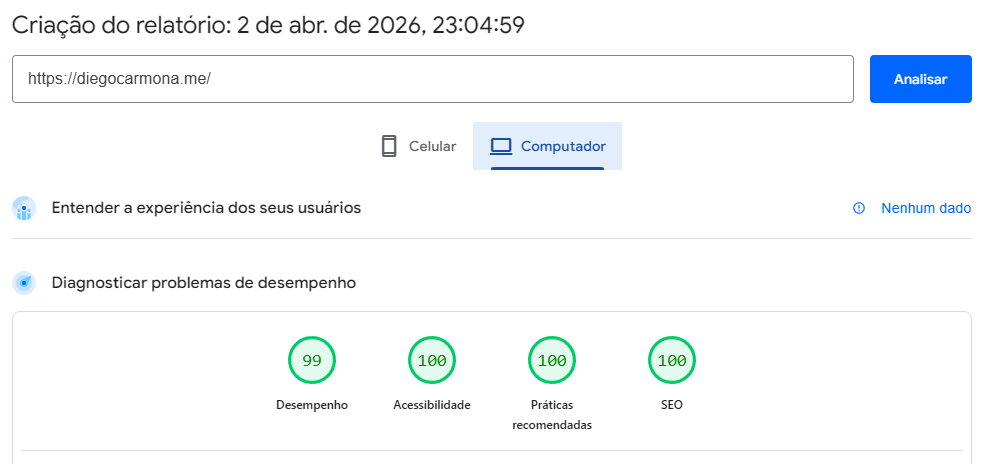
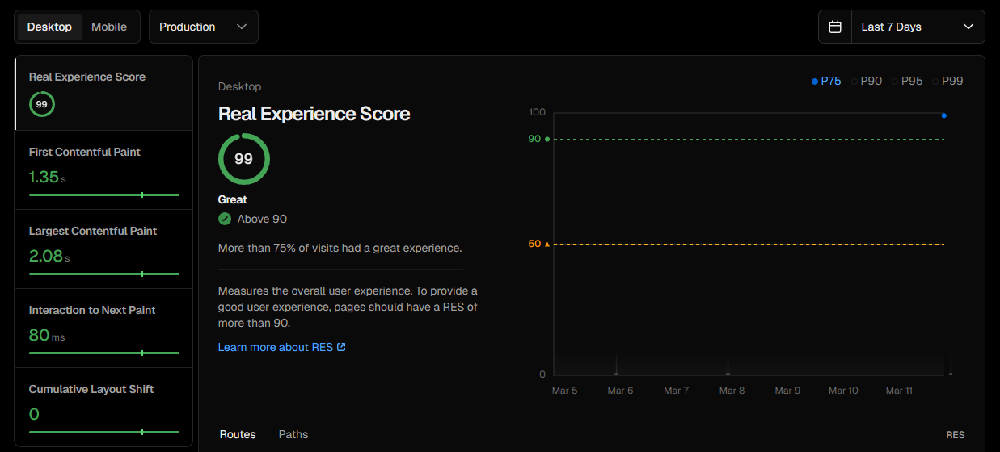

<h1 >
  
  Diego Carmona — Frontend Developer Portfolio
</h1>

<p>
  
  
  
  
</p>

High-performance frontend portfolio built with Next.js, focused on real-world architecture, SEO, and user experience.

🔗 **Live:** https://diegocarmona.me  
📦 **Repo:** https://github.com/diegocarmn/portfolio

## 📸 Preview

<p align="center">
  <video src="https://github.com/user-attachments/assets/fcc28b7f-86f0-462c-8977-241a3ad37582" width="1000" controls loop muted >
</p>

## ✨ Features

- Lighthouse: 99 Performance · 100 Accessibility · 100 SEO
- Real Experience Score: 100 (Vercel Speed Insights)
- Internationalization (EN / PT-BR)
- Full SEO architecture (structured data, Open Graph, sitemap)
- Framer Motion animations + Three.js/Vanta 3D background
- Dark mode, responsive, PWA-ready & accessible

## ⚙️ Technical Details

<details>
  <summary><strong>⚡ PERFORMANCE</strong></summary>
<br>

**Lighthouse**

- Performance: 99
- Accessibility: 100
- Best Practices: 100
- SEO: 100

<p align="center">
  
</p>

**Real User Metrics (Vercel Speed Insights)**

- Real Experience Score: **100**
- First Contentful Paint: **0.34s**
- Largest Contentful Paint: **1.03s**
- Interaction to Next Paint: **48ms**
- Cumulative Layout Shift: **0**
- First Input Delay: **2ms**
- Time to First Byte: **0.05s**

<p align="center">
  
</p>

- Performance optimized with image compression and modern formats
- Accessibility-first design with semantic HTML and ARIA support
- SEO architecture using Next.js Metadata API and structured data
---
</details>

<details>
  <summary><strong>📁 PROJECT STRUCTURE</strong></summary>
<br>

```
src/
├── app/
│   ├── components/
│   │   ├── actions/
│   │   │   └── CopyEmailButton.tsx      # Email copy with visual feedback
│   │   ├── background/
│   │   │   └── VantaBackground.jsx      # 3D background effect wrapper
│   │   ├── navigation/
│   │   │   ├── LanguageToggle.tsx       # Language state toggle
│   │   │   └── Navbar.tsx               # Navigation with active section tracking
│   │   ├── sections/
│   │   │   ├── BentoGrid.tsx            # Bento layout with cards
│   │   │   ├── ContactCard.tsx          # Contact method cards
│   │   │   ├── LocationCard.tsx         # Interactive map zoom with crossfade
│   │   │   ├── ProjectsCard.tsx         # Project showcase card
│   │   │   └── ProjectsCardTag.tsx      # Skill tags component
│   │   ├── theme/
│   │   │   └── DarkModeToggle.tsx       # Theme switcher
│   │   └── ui/
│   │       ├── Button.tsx               # Reusable button component
│   │       ├── LogoButton.tsx           # Social links reusable button
│   │       ├── NavbarButton.tsx         # Navigation button variant
│   │       └── StatusBadge.tsx          # Availability status badge
│   ├── content/
│   │   └── translations.ts              # Language/text data (EN + PT-BR)
│   ├── hooks/
│   │   └── useActiveSection.ts          # Active section detection 
│   ├── lib/
│   │   └── StructuredData.tsx           # JSON-LD structured data (schema.org)
│   ├── motion/
│   │   └── animations.ts                # Framer Motion variants & reusable animations
│   ├── favicon.ico                      # Site favicon
│   ├── globals.css                      # Tailwind + custom properties
│   ├── layout.tsx                       # Root layout with metadata & fonts
│   ├── PageClient.tsx                   # Main client component (page container)
│   ├── page.tsx                         # Page entry point
│   ├── robots.ts                        # robots.txt generation (crawl rules + sitemap)
│   └── sitemap.ts                       # Dynamic sitemap.xml generation
├── public/
│   ├── map/                             # Map assets (zoom levels)
│   ├── screenshots/                     # Website screenshots for README
│   ├── preview.png                      # OG/Twitter preview image (1200×630)
│   └── *.png                            # Project mockups & logos
└── tsconfig.json                        # TypeScript strict mode enabled
```
---
</details>

<details>
  <summary><strong>🔎 SEO</strong></summary>
<br>

- **Metadata API** — titles, descriptions, keywords
- **Open Graph & Twitter Cards** — rich social previews
- **JSON-LD (schema.org)** — `Person` entity with identity, role, and profiles
- **robots.txt + sitemap.xml** — auto-generated via `robots.ts` / `sitemap.ts`
- **Semantic HTML** — clean structure for crawlers and assistive tech

> Indexed within hours of Search Console verification · 15+ organic clicks in first 28 days
---
</details>

<details>
  <summary><strong>💻 LOCAL DEVELOPMENT</strong></summary>

### Requirements

- **Node.js** 18+ (LTS recommended)
- **npm** or **yarn** or **pnpm**

### Installation

```bash
# Clone repository
git clone https://github.com/diegocarmn/portfolio.git
cd portfolio

# Install dependencies
npm install # or pnpm install
```

### Development Server

```bash
npm run dev # Server runs at http://localhost:3000
```

### Build for Production

```bash
npm run build
npm start
```

### Linting

```bash
npm run lint
```
---
</details>

## 📄 License

This project is licensed under the **MIT License**.

> ⚠️ **Note:** Personal branding, identity, and content must not be reused to impersonate or misrepresent the author.

See the [`LICENSE`](./LICENSE.md) file for full details.

## 👤 Author

**Diego Carmona** - Frontend Developer

- 🔗 [LinkedIn](https://linkedin.com/in/diegocarmn)
- 🔗 [GitHub](https://github.com/diegocarmn)
- 📧 [Email](mailto:diegoncarmona@gmail.com)

---

<p align="center">🎧 Crafted with code, curiosity, and a good playlist.</p>
