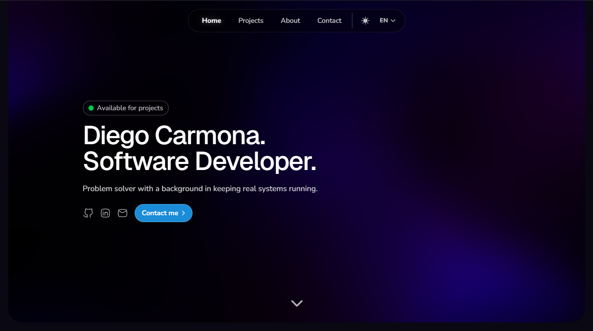

<h1 >
  
  Diego Carmona — Software Developer Portfolio
</h1>

A production-grade, high-performance portfolio built as a real-world web product. Designed with a strong focus on **performance, accessibility, SEO, and long-term maintainability**, while showcasing modern full-stack engineering practices.

🔗 **Live:** https://diegocarmona.me  
📂 **Repository:** https://github.com/diegocarmn/portfolio
## 📖 Overview

This project is a **fully production-ready portfolio** that reflects how I approach real software systems:


<p align="center">
  
</p>

- Clear product identity and positioning
- End-to-end ownership (UX → frontend → SEO → deployment)
- Strong technical foundations with modern React and Next.js
- Measurable real-world results (indexing, ranking, performance)

### ⚡ Lighthouse Score

- Performance: 97
- Accessibility: 100
- Best Practices: 100
- SEO: 100

> ⚠️ **Note:** Measured on production deployment.
- Performance optimized with image compression and modern formats
- Accessibility-first design with semantic HTML and ARIA support
- SEO architecture using Next.js Metadata API and structured data

It is intentionally built as a **single-page application with rich interactions**, while still being **crawlable, indexable, and SEO-safe**.

## ✨ Key Highlights
- Lighthouse 97/100 performance score
- Production deployment with Vercel
- Internationalization (EN / PT-BR)
- Structured data and full SEO architecture


## 🧰 Tech Stack

### Platform & Frameworks

- **Next.js (App Router)** – modern routing, metadata API, and platform primitives
- **React 19** – concurrent rendering and modern composition patterns
- **TypeScript** – strict typing across the entire codebase

### Styling & Motion

- **Tailwind CSS** – zero-runtime styling with design consistency
- **Framer Motion** – declarative, GPU-accelerated animations
- **Three.js + Vanta** – subtle 3D background effects without compromising UX

### Tooling

- **ESLint** – enforced code quality
- **Vercel Analytics** – real usage and performance insights
- **Next/Image & next/font** – asset and font optimization

## ✨ Features

### Performance & UX

- Optimized images and responsive assets via Next.js
- Font loading with zero layout shift using `next/font`
- Smooth section-based navigation with Intersection Observer
- Motion system built on reusable Framer Motion variants
- Mobile-first responsive layout

### Accessibility

- Semantic HTML structure (`main`, `section`, `footer`)
- Proper heading hierarchy
- ARIA labels and keyboard navigation
- Screen-reader-only content for contextual clarity
- Dark mode with accessible contrast ratios

### Internationalization

- English and Portuguese (pt-BR) support
- Centralized translation system
- Dynamic language switching without reloads
- Correct `lang` attribute handling

## 🔎 SEO (Search Engine Optimization)

SEO in this project is treated as **a core part of the system design**.

### 🏗️ Implemented SEO Architecture

- **Next.js Metadata API**  
  Titles, descriptions, authorship, and keywords
- **Open Graph & Twitter Cards**  
  Rich previews with optimized images
- **Structured Data (JSON-LD)**  
  Schema.org `Person` entity with identity, role, location, and profiles
- **robots.txt**  
  Explicit crawl rules and sitemap reference
- **Dynamic sitemap.xml**  
  Auto-generated with priorities and last modification dates
- **Canonical domain consistency**  
  Single authoritative domain for indexing
- **Semantic HTML**  
  Clean document structure for crawlers and assistive tech
- **Favicon & preview assets**  
  Properly exposed for SERP and social platforms

### 📈 Real-World Result

- Indexed within hours of Search Console verification
- Ranking #1 for branded searches such as:
  - name + role
  - name + tech stack
  - name + location

This validates the architecture: strong SEO fundamentals, correct semantics, and fast indexing without sacrificing UX.

### 🧭 SEO Architecture Diagram

```
Search Engine Crawler
        │
        ▼
  robots.txt  ──── ✅ auto-generated via robots.ts (allow: /, sitemap reference)
        │
        ▼
  sitemap.xml ──── ✅ auto-generated via sitemap.ts
        │
        ▼
  HTML Response
   ├── <head>
   │    ├── <title>              ✅ Next.js Metadata API
   │    ├── <meta description>   ✅ Next.js Metadata API
   │    ├── <meta keywords>      ✅ Next.js Metadata API
   │    ├── <meta og:*>          ✅ Open Graph tags
   │    ├── <meta twitter:*>     ✅ Twitter Cards
   │    └── <script ld+json>     ✅ JSON-LD Structured Data
   └── <body>
        ├── <main>               ✅ Semantic landmarks
        ├── <h1> → <h2> → <h3>   ✅ Heading hierarchy
        ├── aria-labels          ✅ Accessibility
        └── sr-only text         ✅ Screen reader content
```

## 📁 Project Structure

```
src/
├── app/
│   ├── components/
│   │   ├── animations.ts          # Framer Motion variants
│   │   ├── BentoGrid.tsx          # Bento layout with cards
│   │   ├── Button.tsx             # Reusable button component
│   │   ├── ContactCard.tsx        # Contact method cards
│   │   ├── CopyEmailButton.tsx    # Email copy with toast feedback
│   │   ├── DarkModeToggle.jsx     # Theme switcher
│   │   ├── LanguageToggle.tsx     # Language state toggle
│   │   ├── LocationCard.tsx       # Interactive map zoom with crossfade
│   │   ├── LogoButton.tsx         # Social links reusable button
│   │   ├── Navbar.tsx             # Navigation with active section tracking
│   │   ├── ProjectsCard.tsx       # Project showcase card
│   │   ├── ProjectsCardTag.tsx    # Skill tags component
│   │   ├── StatusBadge.tsx        # Availability status
│   │   ├── StructuredData.tsx     # JSON-LD structured data (schema.org)
│   │   ├── VantaBackground.jsx    # 3D background effect wrapper
│   │   └── content/
│   │       └── translations.ts    # language/text data (EN + PT-BR)
│   ├── favicon.ico                # Site favicon
│   ├── globals.css                # Tailwind + custom properties
│   ├── layout.tsx                 # Root layout with metadata & fonts
│   ├── page.tsx                   # Main portfolio page
│   ├── robots.ts                  # robots.txt generation (crawl rules + sitemap)
│   └── sitemap.ts                 # Dynamic sitemap.xml generation
├── public/
│   ├── map/                       # Map assets (zoom levels)
│   ├── preview.png                # OG/Twitter preview image (1200×630)
│   └── *.png                      # Project mockups & logos
└── tsconfig.json                  # TypeScript strict mode enabled
```

## 💻 Local Development

### Requirements

- **Node.js** 18+ (LTS recommended)
- **npm** or **yarn** or **pnpm**

### Installation

```bash
# Clone repository
git clone https://github.com/diegocarmn/portfolio.git
cd portfolio

# Install dependencies
npm install
# or
pnpm install
```

### Development Server

```bash
npm run dev
# Server runs at http://localhost:3000
```

The page auto-updates as you edit files (hot module replacement).

### Build for Production

```bash
npm run build
npm start
```

### Linting

```bash
npm run lint
```

## 🚀 Deployment

<a href="https://carmona.vercel.app">Deployed on Vercel</a> with automatic deployments from GitHub:

```bash
# Push to main branch triggers deployment
git push origin main
```

**Benefits:**

- Zero-config deployment
- Automatic SSL
- Edge caching
- Built-in analytics

## 🧹 Code Quality

- ✅ TypeScript strict mode enabled
- ✅ No implicit `any`
- ✅ Exhaustive type checking
- ✅ ESLint with Next.js recommended rules
- ✅ Consistent component boundaries
- ✅ Predictable state and data flow

## 📄 License

This project is licensed under the **MIT License**.

> ⚠️ **Note:** This repository is open-source, but personal branding, identity, and content must not be reused to impersonate or misrepresent the author.

See the [`LICENSE`](./LICENSE.md) file for full details.

## 👤 Author

**Diego Carmona** - Software Developer

- 🔗 [LinkedIn](https://linkedin.com/in/diegocarmn)
- 🔗 [GitHub](https://github.com/diegocarmn)
- 📧 [Email](mailto:diegoncarmona@gmail.com)

📩 Interested in working together?  
Feel free to reach out via LinkedIn or email.

---

<p align="center">🎧 Crafted with code, curiosity, and a good playlist.</p>